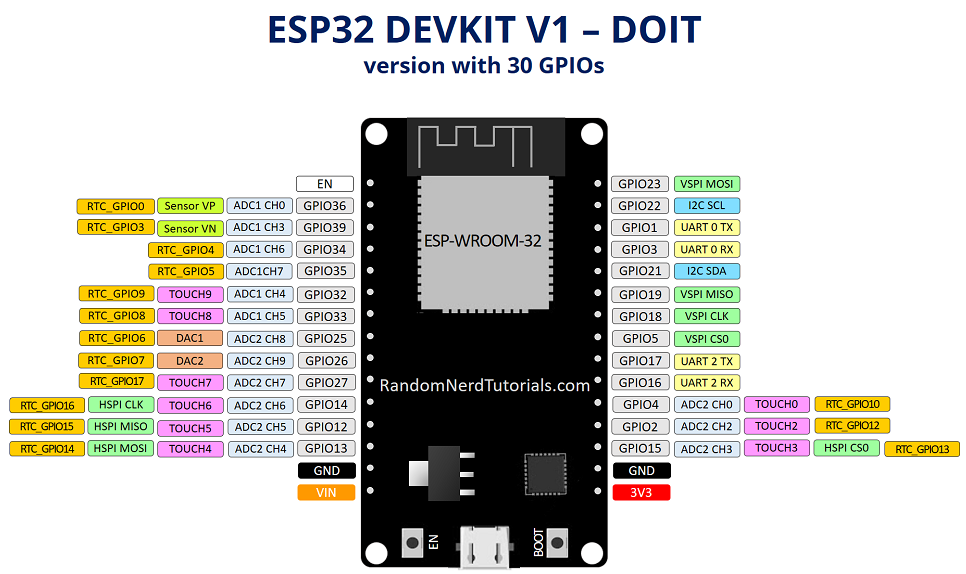

# ESP32 pinout
| Left Side Pins | Label | | Label | Right Side Pins |
| :--- | :--- | :--- | :--- | :--- |
| **EN** | Reset | | **VIN** | 5V Input |
| **VP / GPIO 36** | ADC | | **GND** | Ground |
| **VN / GPIO 39** | ADC | | **D13 / GPIO 13** | MOSI |
| **D34 / GPIO 34** | Input Only | | **D12 / GPIO 12** | MISO |
| **D35 / GPIO 35** | Input Only | | **D14 / GPIO 14** | SCK |
| **D32 / GPIO 32** | LED/BL | | **D27 / GPIO 27** | DC/RS |
| **D33 / GPIO 33** | T_CS | | **D26 / GPIO 26** | CS |
| **D25 / GPIO 25** | RST | | **D25 / GPIO 25** | RST |
| **D26 / GPIO 26** | DAC | | **D33 / GPIO 33** | T_CS |
| **D27 / GPIO 27** | ADC | | **D32 / GPIO 32** | LED/BL |
| **D14 / GPIO 14** | SCK | | **D35 / GPIO 35** | Input Only |
| **D12 / GPIO 12** | MISO | | **D34 / GPIO 34** | Input Only |
| **D13 / GPIO 13** | MOSI | | **VN / GPIO 39** | ADC |
| **GND** | Ground | | **VP / GPIO 36** | ADC |
| **VIN** | 5V Power | | **EN** | Reset |

# Wiring for 4-inch Touch Display with ST7796S Controller and XPT2046 Touch Controller

| Display | ESP32 Pin | GPIO | Function |
| :--- | :--- | :--- | :--- |
| **VCC** | VIN | - | 5V Power (if regulator present) |
| **GND** | GND | - | Ground |
| **CS** | D26 | 26 | Display Chip Select |
| **RST** | D25 | 25 | Hardware Reset |
| **DC/RS** | D27 | 27 | Data/Command Toggle |
| **MOSI/SDI** | D13 | 13 | SPI Master Out Slave In |
| **SCK/CLK** | D14 | 14 | SPI Clock |
| **LED/BL** | D32 | 32 | Backlight (PWM Dimming) |
| **MISO/SDO** | D12 | 12 | SPI Master In Slave Out |
| **T_CLK** | D14 | 14 | Shared SPI Clock |
| **T_CS** | D33 | 33 | Touch Chip Select |
| **T_DIN** | D13 | 13 | Shared SPI Data In |
| **T_OUT** | D12 | 12 | Shared SPI Data Out |
| **T_IRQ** | NC | - | Not Connected |

# LVGL
https://lvgl.io/