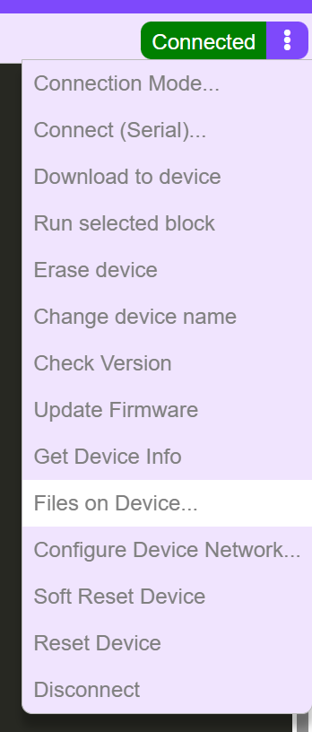
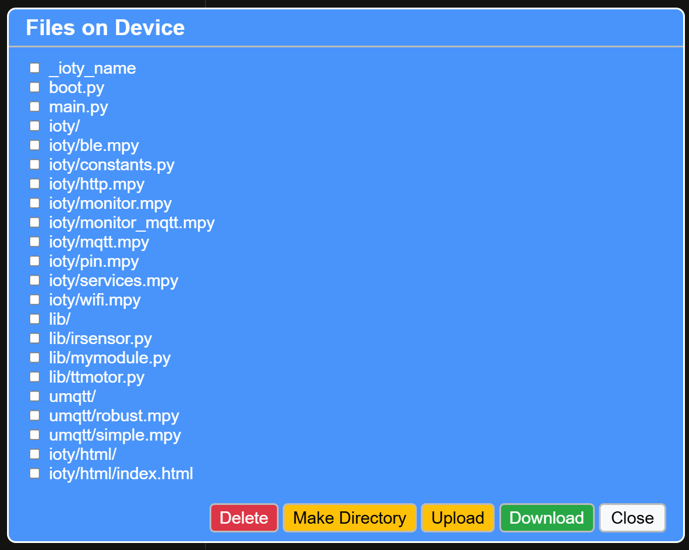
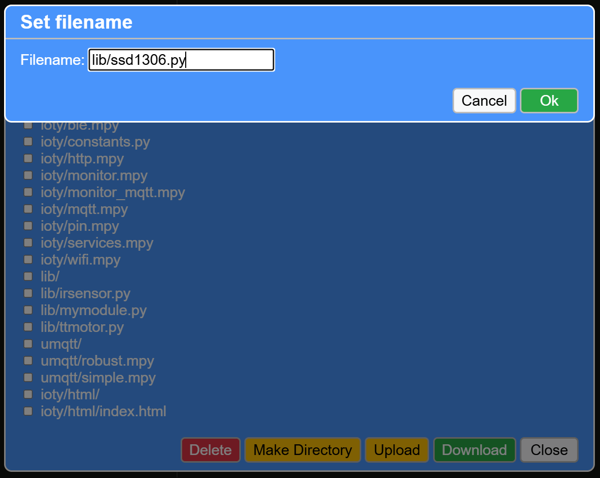
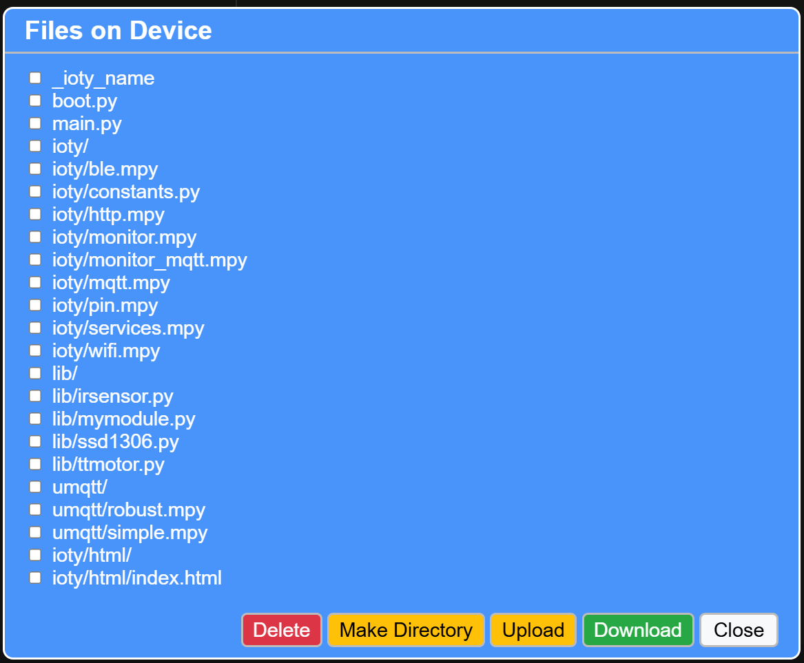

# Overview
These are libs that are not present in microPython's standard library and are used in various projects.

# How to load the libs in ESP32
1. Copy the desired lib file (e.g., `ir_remote.py`) to the `scripts/libs/` directory on your ESP32 device.

Click on the three dots in the top right corner


It will open a menu like this:


Click on "Upload" and select the lib file from your computer to upload it to the `lib` directory on the ESP32.
Note to add a "lib/" prefix to the file name when uploading.


After uploading, the file should appear in the `lib` directory on your ESP32 device.


2. In your main script, import the lib using the following syntax:
   ```python
   from libs import ir_remote
   ```
3. You can now use the functions and classes provided by the lib in your project.
